# Draft ERD CRM

Status: draft v3 berdasarkan data contract, business rules, SOP import,
informasi website, dan
contoh spreadsheet yang tersedia pada 2026-09-17.

Dokumen ini belum menjadi persetujuan migration. Field dan aturan yang masih
ditandai `TODO` harus dikonfirmasi sebelum schema Prisma diubah.

## Diagram

```mermaid
erDiagram
    USER ||--o{ IMPORT_BATCH : uploads
    DEALER ||--o{ IMPORT_BATCH : scopes
    IMPORT_BATCH ||--o{ IMPORT_ROW : contains
    CUSTOMER ||--o{ VEHICLE : owns
    CUSTOMER ||--o{ H1_SALE : purchases
    VEHICLE ||--o{ H1_SALE : identifies
    DEALER ||--o{ H1_SALE : records
    CUSTOMER ||--o{ H2_FOLLOW_UP : receives
    H1_SALE ||--o{ H2_FOLLOW_UP : follows
    H23_INVOICE ||--o{ H2_SERVICE_ITEM : contains
    H23_INVOICE ||--o{ H3_PART_ITEM : contains
    CUSTOMER ||--o{ H2_SERVICE_ITEM : receives
    VEHICLE ||--o{ H2_SERVICE_ITEM : services
    DEALER ||--o{ H2_SERVICE_ITEM : records
    CUSTOMER ||--o{ H3_PART_ITEM : receives
    VEHICLE ||--o{ H3_PART_ITEM : services
    DEALER ||--o{ H3_PART_ITEM : records
    CUSTOMER ||--o{ REPAIR_ORDER : has
    VEHICLE ||--o{ REPAIR_ORDER : references
    DEALER ||--o{ REPAIR_ORDER : handles
    CUSTOMER ||--o{ LCR_FOLLOW_UP : receives
    DEALER ||--o{ LCR_FOLLOW_UP : handles
    CUSTOMER ||--o{ BIRTHDAY_FOLLOW_UP : receives
    CUSTOMER ||--o{ EVENT_REGISTRATION : joins
    DEALER ||--o{ EVENT_REGISTRATION : hosts
    IMPORT_BATCH ||--o{ AUDIT_LOG : produces
    H3_ACTIVATION_LEAD }o--|| LOV_VALUE : uses_contact_status
    H3_ACTIVATION_LEAD }o--|| LOV_VALUE : uses_not_deal_reason
    CUSTOMER ||--o{ H3_ACTIVATION_LEAD : targets
    DEALER ||--o{ H3_ACTIVATION_LEAD : assigns
    CUSTOMER ||--o{ PROSPECT_LEAD : targets
    DEALER ||--o{ PROSPECT_LEAD : assigns
    PROSPECT_LEAD ||--o{ H3_ACTIVATION_LEAD : feeds
    VEHICLE ||--o{ LCR_CAMPAIGN_RECORD : targeted_by
    DEALER ||--o{ LCR_CAMPAIGN_RECORD : operates
    DEALER ||--o{ NIGURI_H1_SNAPSHOT : reports
    DEALER ||--o{ NIGURI_H3_SNAPSHOT : reports

    USER {
        string id PK
        string name
        string email UK
        string password_hash
        string role
    }
    DEALER {
        string id PK
        string code UK
        string name
        string address
    }
    IMPORT_BATCH {
        string id PK
        string file_name
        string file_type
        string status
        datetime uploaded_at
        string uploaded_by FK
        string dealer_id FK
    }
    IMPORT_ROW {
        string id PK
        string batch_id FK
        string sheet_name
        int row_number
        json raw_data
        string validation_status
        string error_message
    }
    CUSTOMER {
        string id PK
        string normalized_name
        string phone
        string nik
        date birth_date
        string email
        string contact_identity_status
    }
    VEHICLE {
        string id PK
        string customer_id FK
        string engine_number UK
        string frame_number
        string model
        string color
        string engine_number UK
    }
    H1_SALE {
        string id PK
        string customer_id FK
        string vehicle_id FK
        string dealer_id FK
        string invoice_number UK
        date invoice_date
        string payment_type
        decimal down_payment
        string status
        string import_row_id FK
    }
    H2_FOLLOW_UP {
        string id PK
        string customer_id FK
        string h1_sale_id FK
        string contact_status
        string result
        date follow_up_date
        string import_row_id FK
    }
    H3_TRANSACTION {
        string id PK
        string customer_id FK
        string vehicle_id FK
        string dealer_id FK
        string invoice_number
        string item_number
        string item_description
        int quantity
        decimal price
        decimal gross_amount
        date invoice_date
        string import_row_id FK
    }
    REPAIR_ORDER {
        string id PK
        string customer_id FK
        string vehicle_id FK
        string dealer_id FK
        string ro_number UK
        date ro_date
        string job
        string status
        decimal cost
        string import_row_id FK
    }
    LCR_FOLLOW_UP {
        string id PK
        string customer_id FK
        string dealer_id FK
        string status
        string contact_status
        string result
        date follow_up_date
    }
    BIRTHDAY_FOLLOW_UP {
        string id PK
        string customer_id FK
        string contact_status
        string deal_status
        date follow_up_date
    }
    EVENT_REGISTRATION {
        string id PK
        string customer_id FK
        string dealer_id FK
        string engine_number
        string location
        string notes
        date event_date
    }
        H23_INVOICE {
            string id PK
            string invoice_number
            string work_order_number
            date invoice_date
            string customer_id FK
            string vehicle_id FK
            string dealer_id FK
            string import_row_id FK
        }
        H2_SERVICE_ITEM {
            string id PK
            string invoice_id FK
            string item_number
            string description
            int quantity
            decimal price
            decimal gross_amount
            decimal discount_rate
            decimal discount_amount
            string mechanic_name
            string sa_id
            string sa_name
        }
        H3_PART_ITEM {
            string id PK
            string invoice_id FK
            string item_number
            string description
            string transaction_type
            int quantity
            decimal price
            decimal gross_amount
            decimal discount_rate
            decimal discount_amount
            string group_part
        }
        H3_ACTIVATION_LEAD {
                int source_id PK
                datetime uploaded_at
                datetime assigned_at
                string customer_id FK
                string source_data
                string md_code
                string assigned_dealer_id FK
                datetime followed_up_at
                string contact_status_lov_id FK
                string contact_label
                string progress_status
                string prospect_status
                string not_deal_reason_lov_id FK
                string has_follow_up
        }
        LOV_VALUE {
                string id PK
                string category
                string value UK
                boolean active
        }
        LCR_CAMPAIGN_RECORD {
                string id PK
                string vehicle_id FK
                string dealer_id FK
                string campaign_code
                boolean is_treated
                string treatment_status
                date invoice_date
        }
        NIGURI_H1_SNAPSHOT {
                string id PK
                string dealer_id FK
                date month
                string source_category
                int total_data_source
                int total_data_analysis_result
                int total_data_followup_phone
                int total_prospect
                int total_customer_deal
                int total_unit_sold
        }
        NIGURI_H3_SNAPSHOT {
                string id PK
                string dealer_id FK
                int year
                string month
                string pipeline
                decimal total_part_sales
                int total_follow_up
                int total_prospect
                int deal_customer
        }
        AUDIT_LOG {
                string id PK
                string batch_id FK
                int row_number
                string field_name
                string error_code
                json raw_value
                string severity
                string system_action
        }
            PROSPECT_LEAD {
                string lead_id PK
                string guestbook_id
                datetime guestbook_at
                string customer_id FK
                string sales_channel
                string event_code
                string platform
                string contact_status
                string contact_channel
                datetime next_follow_up
                datetime sla_deadline
                string prospect_type
                string customer_type
                string assigned_dealer_id FK
                string status
            }
```

## Model relasional yang harus ditambahkan

Diagram awal di atas perlu dibaca bersama penambahan berikut:

### Import dan audit

- `ImportBatch` mewakili satu workbook dan menyimpan file, waktu, status,
    jenis data, serta user pengunggah.
- `ImportRow` menyimpan sheet, nomor baris, payload mentah, status validasi,
    dan relasi ke record domain yang berhasil dibuat.
- `AuditLog` menyimpan warning/error per baris sesuai SOP, termasuk raw value
    dan tindakan sistem.
- Satu workbook multi-sheet tetap satu batch; setiap sheet memiliki parser dan
    kontrak sendiri.

### H23 invoice dan item

H23 adalah satu workbook gabungan H2 dan H3. Header invoice/WO disimpan sekali,
sedangkan detail diarahkan berdasarkan `jenis_transaksi`:

- `H23Invoice`: invoice, WO, tanggal, dealer, customer, kendaraan, dan import.
- `H2ServiceItem`: hanya baris `SERVICE`.
- `H3PartItem`: hanya baris `PART` atau `PARTSERVICE`.

Constraint yang disarankan:

- `H23Invoice`: unique `(dealerId, invNo)`.
- Detail H2/H3: unique `(invoiceId, itemNo, transactionType)` untuk mendukung
    strategi duplicate Last-Win pada staging sebelum upsert final.

### H3 Activation dan LoV

- `H3ActivationLead.sourceId` mempertahankan ID sumber sebagai primary key dan
    tidak boleh diganti dengan ID auto-increment lain.
- Status kontak dan alasan Not Deal direferensikan ke `LovValue`, bukan enum
    hardcoded, agar Master LoV dapat diimpor dan diaudit.
- `H3ActivationHistory` sebaiknya ditambahkan bila setiap perubahan status lead
    harus dipertahankan, bukan hanya status terakhir.

### Prospect pipeline

- `ProspectLead` menyimpan pipeline dari `DataProspek` dan dibedakan dari
    `H3ActivationLead` karena sumber memiliki `ID Leads`, guestbook, SLA,
    assignment, dan status funnel sendiri.
- Sinkronisasi dari `ProspectLead` ke H3 Activation harus menggunakan mapping
    ID yang eksplisit; nama dan nomor HP hanya dipakai untuk matching customer.

### LCR

- `LcrCampaignRecord` mengikat kendaraan, dealer pelaksana, dan campaign code.
- Unique `(vehicleId, campaignCode)` mencegah treatment campaign yang sama
    diajukan ulang.
- `isTreated` dan `treatmentStatus` mendukung antrean aktif serta idempotensi.

### Niguri

- Niguri H1 dan H3 adalah snapshot agregat, bukan transaksi mentah.
- H1 unik pada `(dealerId, month, sourceCategory)`.
- H3 unik pada `(dealerId, year, month, pipeline)`.
- Jika laporan selalu dihitung dari transaksi, tabel snapshot boleh bersifat
    opsional dan hanya dipakai untuk histori hasil laporan.

## Konflik dokumen yang harus diselesaikan sebelum schema

- SOP menyebut LCR sheet `Sheet1`, tetapi contoh workbook yang tersedia belum
    memverifikasi file LCR tersebut. File `LCR MSJ.xlsx` sekarang sudah tersedia
    dan sesuai dengan sheet tersebut.
- `assigned_dealer` H3 Activate dan `Dealer` DataProspek harus disimpan sebagai
    String karena kode dealer dapat memiliki leading zero atau format alfanumerik.
- `disc_rate` ditetapkan sebagai rasio desimal, sehingga `0.25` berarti 25%.
- H23 `SERVICE` ditetapkan sebagai H2, sedangkan `PART` dan `PARTSERVICE`
    ditetapkan sebagai H3.

## Dasar dari contoh file

- H1: `Data Dummy H1.xlsx`, sheet `H1`.
- H23: `Data Dummy H2&H3.xls`, sheet `Data`, berisi H2 service dan H3
    part/partservice berdasarkan `jenis_transaksi`.
- Report: `Report Niguri CRM Dealer.xlsx`, sheet `Niguri H1` dan `Niguri H3`.
- H2 dan H3 berasal dari workbook yang sama dan dipisahkan saat ingest.

## Keputusan yang masih dibutuhkan

- Apakah `No KTP` adalah NIK dan boleh menjadi alternate key customer?
- Apakah nomor mesin selalu unik dan boleh menjadi alternate key kendaraan?
- Apakah `Inv No` unik per dealer atau unik global?
- Apakah satu baris H3 menjadi satu transaksi item, dengan beberapa baris untuk
  satu invoice?
- Dari mana relasi H2 ke H1 dibuat jika H2 tidak memiliki nomor invoice H1?
- Apakah dealer diidentifikasi oleh `Kode Dealer`, `Dealer Name`, atau master
  dealer terpisah?
- Apakah data report Niguri merupakan hasil agregasi yang perlu disimpan, atau
  selalu dihitung dari H1/H2/H3?
- Bagaimana aturan merge customer ketika NIK, nomor HP, dan nama tidak cocok?
